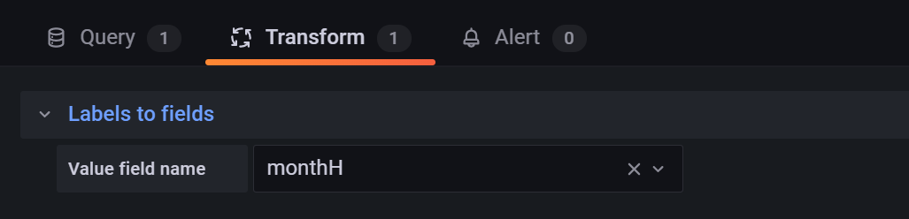

# Enedis2InfluxDB

This code allows to push all history from Enedis to an influxDB instance


## Prerequisite

 - Avoir une instance InfluxDB
 - Installer le plugin scripts
 - Installer le plugin Enedis
 - Autoriser l’accès aux serveurs Enedis : "j’accède à mon espace client
   Enedis"
   

## Setup
 - Dezipper l'archive dans jeedom/plugins/script/data/enedis2InfluxDB
 - Lancer la commande `php composer.phar install`  depuis le folder jeedom/plugins/script/data/enedis2InfluxDB

  

## Configuration

 - Editer le fichier jeedom/plugins/script/data/enedis2influxdb/setup.vars.php
	 - Completer la partie CUSTOM VARS
 - Créer deux scripts:
	 - enedis2influxdb_import
		 - Créer une commande:
			 - Ouvrir le fichier enedis2influxdb/resources/history.php
		 - Le lancer une seule fois manuellement depuis l'option tester de la commande
	 - enedis2influxdb_cron
		 - Mettre une Auto-actualisation (cron): `0 9 * * *`
		 - Créer une commande:
			 - Ouvrir le fichier enedis2influxdb/resources/cron.php


## Grafana: requetes
### Consommation par mois


Requete:
```
import "date"
year = date.truncate(t: now(), unit: 1y)
from(bucket: "<bucket_name>")
|> range(start: year)
|> filter(fn: (r) => r["_measurement"] == "electricity")
|> filter(fn: (r) => r["mode"] == "daily")
|> filter(fn: (r) => r["_field"] == "energy")
|> aggregateWindow(every: 1mo, timeSrc: "_stop", timeDst: "_time", fn: sum, createEmpty: false)
|> yield(name: "sum")
```
Transform:
 - Labels to fields et selectionner monthH



Visualisation de type graph
Axes:
 - Left Y:
	 - Unit Wh
 - X-Axis:
	 - Show: ok
	 - Mode: Series
	 - Value: Total


### Consommation par jour

Requete:
```
from(bucket: "<bucket_name>")
|>  range(start: v.timeRangeStart,  stop: v.timeRangeStop)
|> filter(fn: (r)  => r["_measurement"] == "electricity")
|> filter(fn: (r)  => r["mode"] == "daily")
|> yield(name: "mean")
```
Query option:
 - Relative time: now/M


Transform:
 - Labels to fields et selectionner monthH


Visualisation de type Time series

###  Puissance moyenne consommée sur 30 min

Requete:
```
from(bucket: "<bucket_name>")
|> filter(fn: (r)  => r["_measurement"] == "electricity")
|> filter(fn: (r)  => r["_field"] == "power")
|> yield(name: "mean")
```
Query option:
 - Relative time: now-1d/d


Visualisation de type Time series